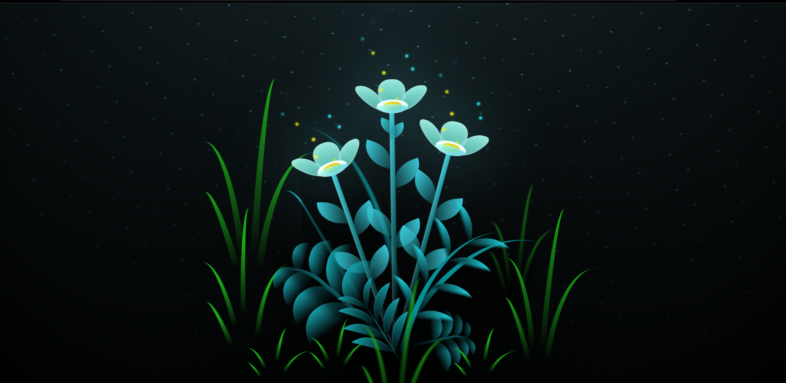

# 🌼 Animation_Flower 🌸

This folder contains the source code for a mesmerizing flower animation created using HTML and CSS. The animation features a bouquet of colorful flowers swaying gracefully against a dark, atmospheric background. 🌙✨

## Preview
  
You can see the live animation by opening the index.html file in a modern web browser. 🌐🖥️

Features  
Realistic flower animations with petals and leaves gently swaying. 🌸🍃 
Dynamic background with a night sky and subtle lighting effects. 🌌💫 
Smooth transitions and attention to detail for a lifelike experience. 🎉🌟 
Customizable colors and animation parameters using CSS variables. 🎨🔄   
Usage  
Clone this repository to your local machine. 
Open the index.html file in a web browser. 
Sit back, relax, and enjoy the mesmerizing flower animation! 🌼📺  
Customization  
You can customize the animation by modifying the CSS variables in the styles.css file. Feel free to experiment with colors, animation durations, and other parameters to create your own unique visual experience. 🎨✏️

Credits
This animation was created with love by Minal Kumari. Feel free to reach out for questions or suggestions. 🙌❤️